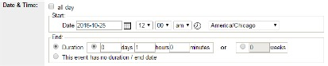

# Date and Time

- All Day: Select “all day” for exhibits or one-on-one help where customers can make an appointment at any time during the day. All other events get a start time and end time or a start time and no duration.
- Start: Select the date of your event. For recurring events, like story times, enter the date for the first instance of the series.
- End: Select a duration in hours or minutes OR choose no duration if you do not want to specify an end time. Only use days or weeks for exhibits.

# Status

-	Do not change. Keep “confirmed” selected.
