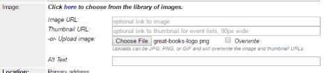

# Image

## Adding an Image (Two options, pick one)

### Option 1 - Add an image by using the image URL

1.	Use an image from the Image Library.
    1.	Click “here” to see if an image/logo already exists for a recurring or themed program.
    1. Copy the Image URL from the spreadsheet and pinto the Image URL field on the form.
    1. Copy the Thumbnail URL from the spreadsheet and paste into the Thumbnail URL on the form.
    1. Add Alt Text. Alt Text helps the seeing-impaired identify pictures.
1. Use an image from the library catalog.
    1. Go to the [library catalog](https://catalog.library.nashville.org).
    1.	Search for the book or movie title.
    1.	Go to Item detail page. Don’t copy the image from the results list because it is too small.
    1.	On the item detail page, right click on the cover image and select “Copy Image location” / "Copy image address" / "Copy Shortcut" (if you’re using Windows, right-click, click Properties, and copy the URL). The URL will look something like this: https://catalog.library.nashville.org/bookcover.php?id=2b8a0cd6-dac0-50b8-50a5-2543e1316816&size=medium&type=grouped_work
        1.	Paste the image URL into both the Image URL and Thumbnail URL fields.
        1.	In the Image URL field, edit the URL to replace the word “medium” with the word “large”. This allows the event to display correctly on digital signs for book clubs.
        1.	Add Alt Text. Alt Text helps the seeing-impaired identify pictures.

### Option 2 - Upload an image to Bedework

1.	Find an image (see Image section of guide for copyright-friendly image sources) and save it to your computer.
1.	Resize the image. Max width for the calendar is 450px.
1.	Save the resized image to your computer. Make sure there are no blank spaces in the image file name (e.g., do not name an image “stack of books.jpg”).
1.	In the Image section of the Bedework event form (when adding an event), click Choose File.
1.	Find the resized image on your computer and click Open.
1.	If your image uploaded successfully, you’ll see a file name after the “Choose File” button.
1.	Add Alt Text. Alt Text helps the seeing-impaired identify pictures.
1.	Your image will be visible in the event listing after you click Add Event at the end of the form.
