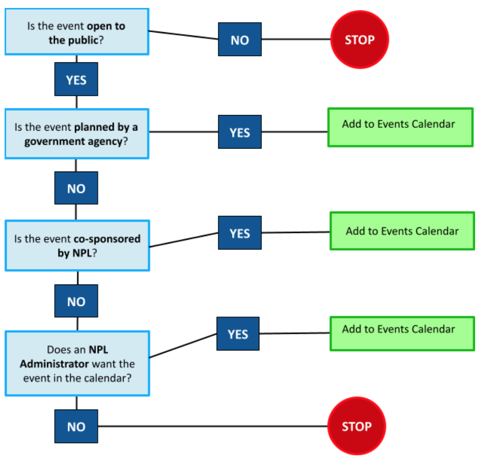

# Public Events at Main

## Should I add this event?

 

## Fine Print

These events DO get added to Bedework (NPL Public Events Calendar):
-	Events planned by government agencies and open to the public.
-	Events planned in conjunction with NPL staff. When Nashville Public Library is a co-sponsor, or has arranged the event for the library patronage. Library logos should only go on Library sponsored or co-sponsored events. Having an event at the Library or the Library sharing information about an event does not necessarily equal Library sponsorship or co-sponsorship. If you have questions about whether an event is sponsored or co-sponsored by NPL, ask your manager.
-	Other ‘open to the public’ events, at Library Administrator’s discretion.

These events DO NOT get added to Bedework (NPL Public Events Calendar):
- Private events. Receptions, weddings, etc.
- After-hours private events.
- Paid nonprofit or business meetings that are not open to the public.
- Planned by nonprofits, open to the public, but not library co-sponsored.

### Administrator Discretion
Main Library Administrator overrides these protocol, when necessary. They report to MarComm and Web Services when there’s an exception to the above lists.

## Who adds events?
- Main Library Staff are responsible for adding events to Bedework
    - When Main Library staff plan an event with an outside group, they will add the event into calendar system.
    - Consult table above to see if event arranged with an outside organization qualifies for event calendar listing.
- Big Events with no singular contact at Main Library
    - Marketing/Communications will add large events that may fall outside the normal course of business (ie. Governor’s Debate, State of Metro, Federal Government Press conference, Foundation Fundraiser, Non-profit festivals, Director’s Office or Library Board-arranged).
    - Shared Systems will review and publish events listings.
