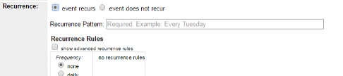

# Recurrence Pattern

## Guidelines
- **Do not include recurrence pattern in the description field.** This goes only in the recurrence pattern field.
- Use 3 letter abbreviation for months: Jan, Feb, Mar, Apr, May, Jun, Jul, Aug, Sep, Oct, Nov, Dec
- Use entire word for days: Monday, Tuesday, Wednesday, etc.
- Do not use a period at the end of the field.
- Cross-reference events that have multiple times/dates.
    - List “Citizenship Class with Nashville Adult Literacy Council, Every Monday and Tuesday, 10:00 AM-12:30 PM, and 5:45 PM-7:30 PM” in the recurrence pattern field for citizenship classes that happen on multiple dates and times.  
- Only include times in the Recurrence Patterns text field if the same event occurs at multiple times on the same day.
    - List “Every Tuesday at 9:30 AM, 10:30 AM, 11:30 AM” in the recurrence pattern field for story times that have multiple showings per day.

## Add Recurrence Pattern (Required)

- When viewed in the events calendar, the text from the Recurrence Pattern field will display as the first sentence in your description.

**Recurrence Pattern is required for all repeating events.** If you leave this field blank, we will not approve your event.
1.	Select `event recurs` to bring up the recurrence menu.
1.	Type the recurrence pattern in the Recurrence Pattern field.

## Listing Exceptions
- ONLY list exception dates if there is no “replacement” event occurring on the same day and time as the regular program, for the same age group.
    - List “Every Tuesday except Sep 5” for Preschool Story Time if there will be no story time, featured guest, or other event for preschool children to attend on that day and time.
- DO NOT list exceptions for events that fall on days NPL is closed (e.g., do not list “Every Tuesday except Jul 4”).
- DO NOT list exceptions when a regularly recurring event is replaced by a featured performer for one (or more) weeks in an events period.
    - do NOT list “Every Tuesday except Jun 6, Jul 11, Aug 8” for Preschool Story Time if Nashville Ballet, Mr. Bond and The Science Guys, and Nashville Zoo events are happening at the same time on those three days.

## Examples

- Exhibits. Use only the end date.
    - :white_check_mark: Through Jul 31
    - :x: Jun 1 - Jul 31
- Weekly repeating event
    - :white_check_mark: Every Wednesday
    - :x: Every Tuesday each week
    - :x: Tuesdays
- Weekly repeating event with multiple instances on same day
    - :white_check_mark: Every Thursday at 10:00 AM and 11:00 AM
    - :white_check_mark: Every Tuesday and Wednesday at 9:30 AM, 10:30 AM, and 11:30 AM
    - :white_check_mark: Every Tuesday and Thursday, 10:00 AM–12:30 PM and 5:45–7:45 PM
- Weekly repeating event, multiple days, varying times
    - :white_check_mark: Every Wednesday, 3:00–6:00 PM; Every Sunday, 2:00–5:30 PM
    - :white_check_mark: Every Wednesday at 10:00 AM; Every Thursday at 5:30 PM
    - :white_check_mark: Saturdays: Mar 17 and May 19 at 2:00 PM; Monday, April 23 at 4:00 PM
    - :white_check_mark: 1st Mondays: Jun 3 and Jul 1 at 1:00 PM; Aug 5 at 5:00 PM
    - :white_check_mark: Monday, Dec 10 at 6:00 PM; Wednesday, Dec 19 at 12:30 PM
    - :white_check_mark: Every Monday: 5:45–7:45 PM; Every Wednesday: 9:45–11:45 AM
    - :x: (not “cross referencing”, i.e. “Every Wednesday, 3:00–6:00 PM” on Wednesday entry, and “Every Sunday, 2:00–5:30 PM” on Sunday entry)
- Daily/weekly repeating event:
    - :white_check_mark: Monday-Thursday
    - :x: Every weekday
    - :x: Mondays through Thursdays
- Daily/Weekly repeating event based on school year
    - :white_check_mark: Monday-Thursday while school is in session
    - :white_check_mark: Mondays, Wednesdays, and Fridays while school is out
- Monthly repeating event
    - :white_check_mark: Thursdays: Mar 21, Apr 14, May 16
    - :white_check_mark: 1st Thursdays: Dec 7, Jan 4, Feb 1
    - :white_check_mark: 1st Mondays and 3rd Tuesdays: June 4, 19, Jul 2, 17, Aug 6, 21
    - :x: Every First Tuesday
    - :x: Every 1st Tuesday of the month
    - :x: 1st Mondays, monthly
    - :x: Every 2nd and 4th Thursday
- Repeating events without regular recurrence pattern
    - :white_check_mark: Wednesdays: Dec 9 and Jan 20 (for two instances only - use “and”)
    - :white_check_mark: Thursday, Jan 2 and Friday, Jan 3 (for two instances only - use “and”)
    - :white_check_mark: Wednesdays: Dec 9, Jan 20, Feb 3 (for three or more instances - use commas)
- Repeating events that span only part of the quarter
    - :white_check_mark: Wednesdays: Mar 7 - Apr 18
    - :x: Every Wednesday
    - :x: Wednesdays: Mar 7, 14, 21, 28, Apr 4, 11, 18
- Weekly recurring events with UP TO THREE EXCEPTIONS in events period (NO other events are replacing). See exceptions section, above, for rules.
    - :white_check_mark: Every Thursday in Jun, except Jun 29
    - :white_check_mark: Every Thursday, except Dec 26, Jan 19
    - :white_check_mark: Every Monday, except Sep 11, Oct 9, Nov 20
    - :white_check_mark: Every Tuesday, except Sep 11, 18
- Weekly recurring events with MORE THAN THREE EXCEPTIONS: list dates individually
    - :white_check_mark: Thursdays: Sep 6, 27, Oct 3, 10, 24, Nov 1, 8, 15, 22, 29
- By appointment only events (Set duration as “all day” in Bedework)
    - :white_check_mark: Mondays, Tuesdays, and Thursdays, by appointment
    - :white_check_mark: Monday-Wednesday, by appointment
