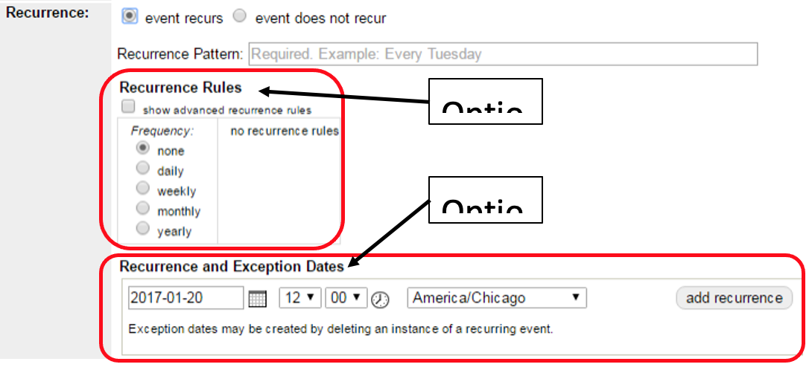

# Recurring Events

## Step 1: Determine if your event is a recurring event

A recurring event is an event that repeats several times during a quarter at the same time of day. Often recurring events are regular (happen on the same day) but they can have irregular dates.

### The two determining factors:
-	Same event repeats multiple times
-	Event happens at the same time of day (same hour/time) every time

### Examples:
-	2nd Wednesday Book Club - Yes
    -	Event is always on 2nd Wednesdays (repeats with a pattern) at 2pm (same time of day).
-	Friends of the Library 3-Day Book Sale - No
    -	Event happens 3 times (repeats, no pattern). But, each day has different hours (NOT same time of day).
-	Monthly Movie Matinee, times vary - No
    -	Event happens one time per month, but not on set schedule (repeats, no pattern). But, each movie event happens at a different time of day (NOT same time of day).

## Step 2: Type the Recurrence Pattern (Required for all Recurring Events)

1.	Consult the NPL Style Guide for examples on how to write recurrence pattern text.
1.	Select “event recurs” to bring up the recurrence menu.
1.	Type the recurrence pattern in the Recurrence Pattern field.
    1.	Recurrence Pattern is required for all recurring events.
    1.	If you leave this field blank, we will not approve your event.

## Step 3: Set the Recurrence Pattern for the Calendar Listings (Two Options, Pick One)

Choose your recurrence method. There are two ways to add recurrences. Choose ONLY ONE OPTION. Do not use both.
1.	Option 1: Recurrence Rules: Add recurrence with a pattern, like “Every 1st Thursday” or “Every Saturday”.
    1.	Look in the “Recurrence Rules” section of the form.
    1.	Select the checkbox next to “show advanced recurrence rules”.
    1.	Select the frequency (daily, weekly, monthly)
    1.	Under Repeat, select an end date one day past the end of the next quarter. (e.g., for a program occurring every Thursday through the 30th, enter the end date as the 31st). **Do not keep _forever_ selected**.
    1.	Under Interval, define the recurrence pattern.
        -	For every other Monday => Select “weekly” (under “Frequency”) + change the interval to “every 2 weeks” + select the day of the week.
        -	For every 2nd and 4th Wednesday => Select “monthly” (under “Frequency”) + change the drop down (under “Interval”) to “the second” + check the box next to Wed. Then change the drop down (under “Interval) to “the fourth” + check the box next to Wed.
        -	Do not touch any options in the “Recurrence and Exception Dates” section.

1.	Option 2: Recurrence Dates: Add recurrence by individually adding specific dates.
    1.	Look in the “Recurrence and Exception Dates” section.
    1.	Select the start date for the second instance of your event (the first instance is the start date at the top under “Date & Time”,  the recurrence section lists all instances after the first instance).
    1.	Select the start time for your event (this time it is in military/24 hour time).
    1.	Click Add Recurrence.
    1.	Repeat until all instances of your event have been added.

1.	Check your work.
    1.	After you add your event, click on the Approval Queue tab.
    1.	View your recurring event entry (make sure you select the master event).
    1.	Look at the Recurrence section of the form. Recurrence pattern will be transformed into natural-ish language.
    1.	Go back to the Approval Queue and scroll down to verify the recurrence has added all the correct dates.

## Step 4: Delete Recurrences that Fall on Special Event Days

When it is time to create the back of book listings for Unbound, Web Services exports data from the calendar. All events entered as recurring events will be condensed into one listing. If you have a special themed story time, you must delete the instance from the recurring event, then re-add the special story time as a separate event.

For example, Miss Sue’s Story Time starts on December 1st and repeats 12 times in the calendar. But Gnash is coming on December 15th. Here’s how Sue will add this to the calendar:
1. Sue will add Miss Sue’s Story Time to the calendar as a recurring event.
1. After saving her event, Sue will click on the Approval Queue tab and find the December 15th instance of her event and click on the word “instance” (in the description column) .
1. Once in edit mode for that December 15th instance, Sue will click Delete Event.
1. Now Sue will add a new event just for the December 15th Gnash story time.

## Step 5: Add Details for Movie Series and Book Clubs

### In the master event
-	Use a generic title and description
-	List the book or movie titles for the upcoming months in the description for all instances

### In each individual instance:
-	Edit the title to add the name of the book or movie (if you know the titles), for example “Coffee and Classic Movies: North by Northwest.”
-	Add the cover image to each instance
-	If the event series is a movie, edit each instance to add the movie description, rating, runtime, and year underneath the generic description.

For details on how to type Master / Instance movie titles and descriptions, see the NPL Style Guide.
