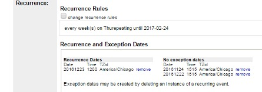

# Approving Events

## Check the approval queue once a week

1.	Log in to Bedework with your Approver credentials: [Calendar Admin Login](https://events.library.nashville.org/caladmin)
1.	First screen is “Choose Your Administrative Group”, which is where you will select which group’s events you’re going to review/approve.
1.	Select a group (see Approvers by Group for group assignments).
1.	Click on Approval Queue tab.
1.	You’ll see a list of all events for that group and the author (staff person who submitted the event).
1.	Select an event.
1.	Edit / Correct / Review Images / Tag
1.	Scroll to the top and click Approve Event.

## Checking Rules and Recurrence and Exception Dates

-	“Recurrence Dates” list displays recurrences added to an event.
- “No exception dates” list displays instances that were deleted.
-	When proofing recurrence times that were added by date (not pattern), be sure to check the time.

## Review Images
- See Image Specifications section for review criteria.

If a staff-submitted image doesn’t meet specifications:
1.	Note the changes that need to be made to make the image usable in the calendar.
2.	Ask if the creator has time to remake the image and list the changes we would like them to make.
3.	Once the image meets the guidelines for the calendar, upload to the event listing. Grab the image URL generated by Bedework, and drop the image URL to the images spreadsheet for reuse next quarter.

## Kick Back Events Under the Following Conditions
Email staff submitter and request that they redo their submitted event if any of the following are true:
-	Description or entry veers really far from style guide (no effort made at good description, missing information required from style guide that editors have to go look up). Kick back at approver discretion.
-	Ages - Must include ages for any event for Teens and Children (even if for Adults and Teens).
-	If event series is entered as separate events rather than as recurring event.
-	Recurrence pattern issues:
-	The recurrence pattern (2nd Wednesdays, Every Friday) is not in the recurrence pattern field.
-	The end date for the recurrence pattern is too far into the future (recurrences should only run for 3 months).
-	The end date for the recurrence pattern is not the day after the last date of the recurrence.
-	Image issues:
    -	Uploaded images are too large.
    -	Images are added with a URL, but should have been uploaded.

## Fix the Following
Fix the submitted event if any of the following are true:
-	Tags are missing.
-	Spelling errors.
-	Small copy mistakes.
-	Fix mistakes and reply to staffer if something they need to watch for next time.
