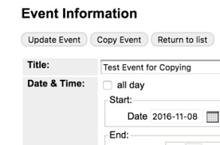

# Add Your First Event

## Add an Event
1. Go directly to the calendar by typing the URL: [https://events.library.nashville.org](https://events.library.nashville.org)
1.	Scroll to the bottom of the left menu.
1.	Select Manage Events.
1.	Log in.
1.	Click Add Event.
1.	Fill out the Event Information form.
1.	Click Add Event at the end of the form.
1.	If you added a recurring event, click on the Approval Queue tab and delete any instances that fall on holidays or days when your event is not taking place. Also delete any instances for special story times or other events that need separate listings in Unbound.

## Edit / Delete an Event
1. Go directly to the calendar by typing the URL: [https://events.library.nashville.org](https://events.library.nashville.org)
1.	Scroll to the bottom of the left menu.
1.	Select Manage Events.
1.	Log in.
1.	Click the Approval Queue tab.
1.	If your event is in the Approval Queue, you can edit or delete it:
    1.	Click the title of your event.
    1.	If you are editing / deleting an instance, go ahead. If you need to edit / delete a recurring event, be sure to select “edit or publish master event”.
1.	If your event is not in the Approval Queue:
    1.	Contact Jenny Ellis or Kyle Cook for help.

## Copy an Event
If you are adding a single event that happens more than once, but at different days and times (not recurring), you can create one event listing and then copy it. This is most often used for Book Sales that are multiple days but with no pattern. For example, a book sale that happens Friday 10-6, Saturday 10-4, Sunday 2-5.

You can only copy an event if it is not recurring.

1.	Go to the events calendar: [https://events.library.nashville.org](https://events.library.nashville.org)
1.	Scroll to the bottom of the left menu.
1.	Select Manage Events.
1.	Log in.
1.	Click the Approval Queue tab.
1.	Click the title of your event.
1.	Click Copy Event.
1.	Change the date and time for the next instance of the event.
1.	Click Add Event.
