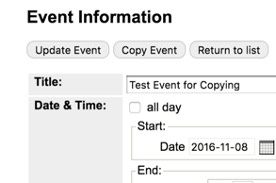

# Copy an Event
If you are adding a single event that happens more than once, but at different days and times (not recurring), you can create one event listing and then copy it. This is most often used for Book Sales that are multiple days but with no pattern. For example, a book sale that happens Friday 10-6, Saturday 10-4, Sunday 2-5.

You can only copy an event if it is not recurring.

1.	Go to the events calendar: [https://events.library.nashville.org](https://events.library.nashville.org)
1.	Scroll to the bottom of the left menu.
1.	Select Manage Events.
1.	Log in.
1.	Click the Approval Queue tab.
1.	Click the title of your event.
1.	Click Copy Event.
1.	Change the date and time for the next instance of the event.
1.	Click Add Event.
